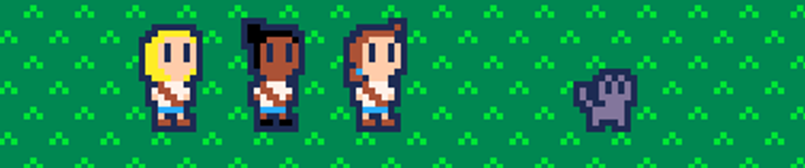
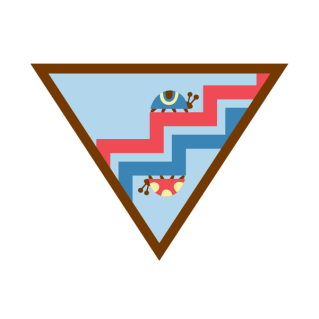
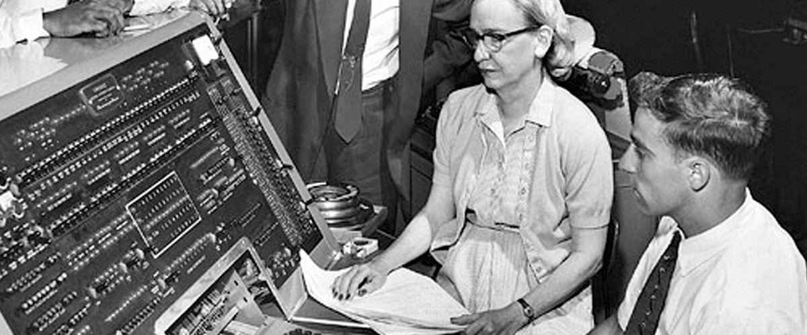
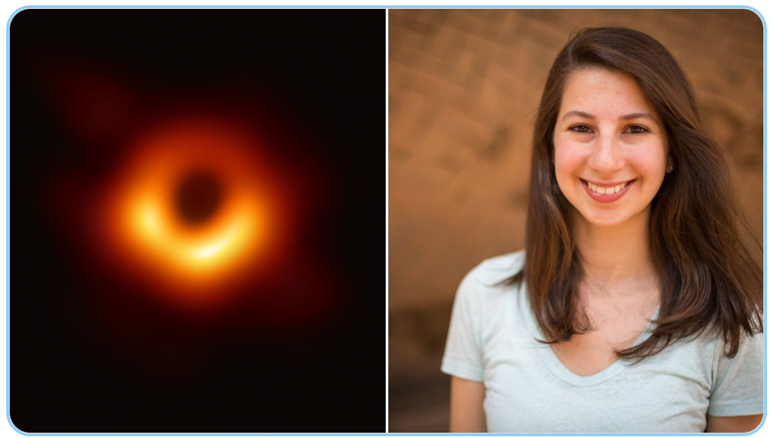
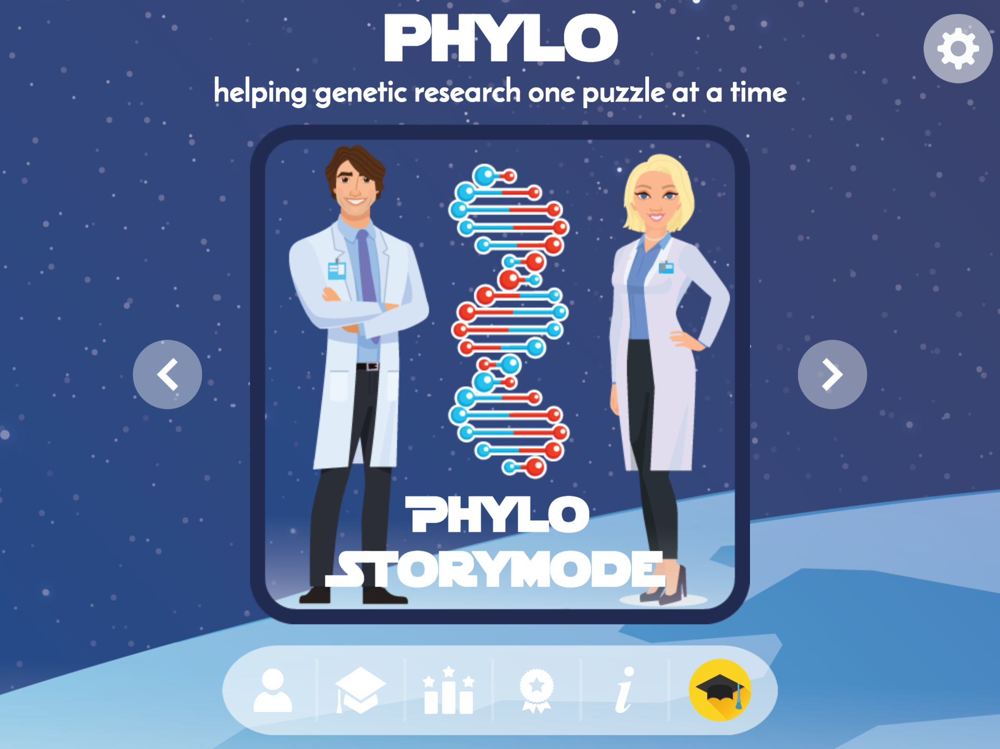
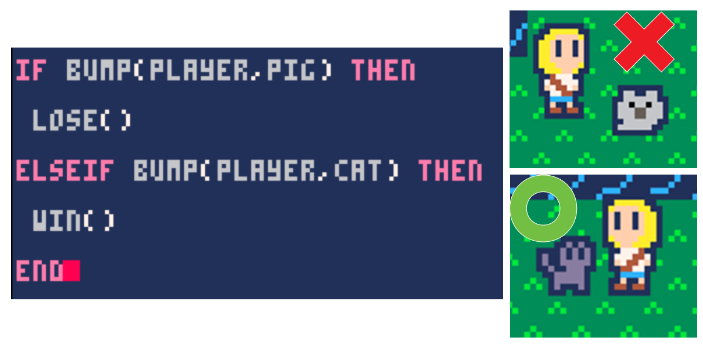
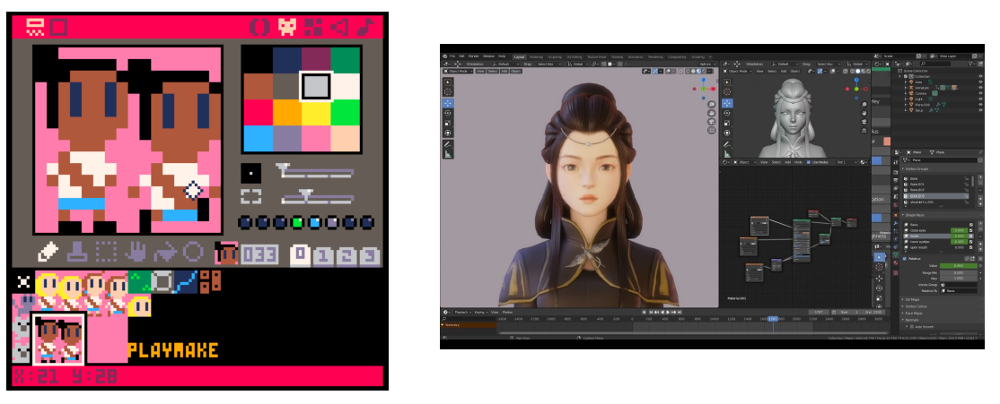
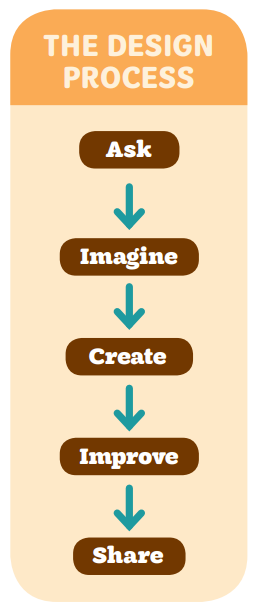
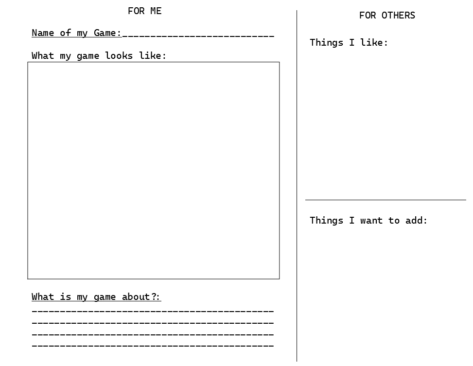

@import "my-style.less"

# Digital Game Design
## An activity for badge 2 in the "Coding for Good" series for Brownies

### Have you ever wondered how video games are made?
They are made by girls like you! It takes lots of different skill sets and people to make a digital game:
- **Programmers** tell a computer what to do by writing very specific instructions, called *code*, into a computer. Code is sort of like a recipe - computer know how to follow these instructions very closely.
    - How do computers know how to understand code? Grace Hopper was a pioneer in programming computers, and she helped build tools called *compilers* for the US Navy to let computers understand code.

    - Today, programmers like Katie Bouman use code to help us do things we have never done before, like take pictures of black holes!
    - 
- Games aren't just code, though. It takes artists, musicians, and game designers to make games come to life!

Today, let's learn a little about how games can be used for good and how they are made. Then, we will experiment with building and testing our own games!

### 1. Game design can be used for good!

Games can bring us together and help us to have fun, but that's not all they can do. Many people use games today to help teach people important things, to spread awareness about causes, and to help gather information that can be used to help doctors!

#### Games to help medicine
*Phylo* is a game made by researchers at McGill University. It is a fun puzzle game, but it also helps researchers collect data on our DNA to help cure diseases.

#### Games to learn languages
Duolingo is a popular computer program and phone app for learning new languages, like Spanish or Italian. The creators of Duolingo have said that they like video games, and they used mechanics from video games like "rewards, challenges, and leveling-up" to help people enjoy learning a language!

### 2. What kinds of tools are used to develop video games?

Lots of different tools are used to make digital games!

**Computers** are used to make the *code* for a game. A *programmer* tells the computer how characters will behave, what happens when someone pushes buttons, and how you win or lose.

*Example of code that decides the game's rules*

Games need lots of other things too! **Artists** will draw backgrounds and use special computer programs to make models that appear in games. **Musicians** can use computers or their own instruments to make the sounds in games. **Designers** figure out how a game is played - what are the rules, what can you do, and how do you win!

*Depending on your game, you might draw simple art or make intricate 3D models*

### 3. Activity Time!

In both of these activities, we will be following the game design process:

In this process, we start by doing creative work - asking ourselves questions, imagining what could be, and then creating it! This can be done alone or in a team.

Next, we **collaborate** - we share our work, understand what someone liked and didn't like, and then adjust our original ideas. After going through this loop - share, adjust, share, adjust - we have a great game to share!

#### Activity 1: Design your own game

**Game Designers** start designing a game with paper and art supplies! A great way to get started is to draw and write down your ideas for a game, then show them to you friends and get feedback!

We are going to build a **game design document** so we can share our ideas with our friends!

High quality version for printing: [Game Design Document](assets/worksheet_game_design_brownie.pdf)

##### Instructions:
1. Each participant should get their own copy of the Game Design Document. Spend a few minutes and draw some ideas for your game!
    a. Draw a picture of what it might look like.
    b. Give it a name.
    c. Describe what you might do in this game. Be as creative as you want! Don't be afraid to be inspired by your favorite books, movies, or other video games!
2. After designing your game, let some of your friends look at your paper!
    a. When you are looking at your friend's game, write down 1 thing you like, and 1 thing you think would be fun to add!

#### Activity 2: Make a game level for your friend to play

Get into small groups (2-4 scouts) and take turns playing "Girl Scout Cat Rescue!". One girl should spend a few minutes designing a maze, then the next girl should try to get through the maze and get to the cat. Then, switch! Have someone else try to design a level!

<iframe src="girlscout.html" title="Girl Scout Game"></iframe>